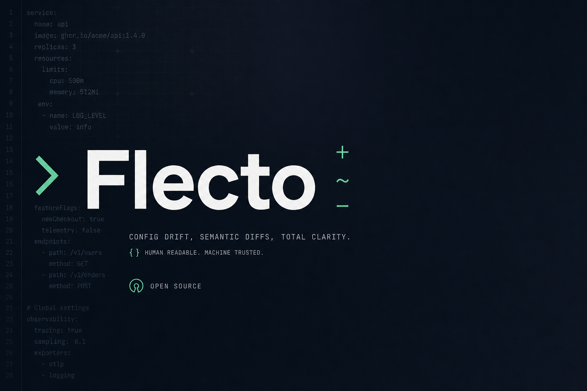
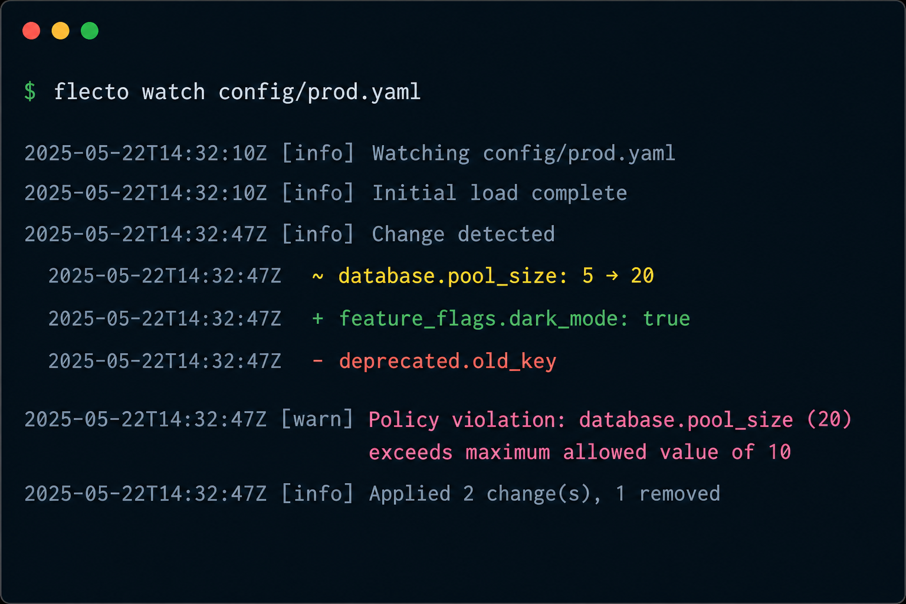

<p align="center">
  
</p>

<h1 align="center">Flecto</h1>

<p align="center">
  <strong>Config changes, in plain English — with risk flags built in.</strong><br/>
  Watch · Diff · Policy · CI · Webhooks
</p>

<p align="center">
  <a href="https://www.npmjs.com/package/flecto"></a>
  <a href="https://github.com/myselfsiddharth/Flecto/actions/workflows/ci.yml"></a>
  <a href="LICENSE"></a>
  <a href="https://github.com/myselfsiddharth/Flecto/stargazers"></a>
</p>

<p align="center">
  <a href="https://github.com/myselfsiddharth/Flecto/stargazers">⭐ Star this repo</a> if Flecto saves you from a noisy config diff — it helps others find the project.
</p>

<p align="center">
  
</p>

<p align="center">
  
</p>

---

## Why teams use Flecto

Line diffs lie about config. Formatting churn, key reorders, and “small” YAML edits hide the changes that actually matter in production.

**Flecto** turns structured config into semantic events:

- What changed (`pool_size: 5 → 20`)
- What was added or removed
- What looks risky (secrets, dangerous toggles, pool jumps)
- What to do next (CI gate, webhook, shell command)

> Diff tools compare trees. **Flecto watches, scores risk, and alerts.**

| Without Flecto | With Flecto |
|---|---|
| `+  40 lines of YAML noise` | `~ database.pool_size: 5 → 20` |
| Hope someone notices `debug: true` | Policy finding → CI fails |
| “Something in `.env` changed” | Exact keys + optional secret masking |

---

## Install

```bash
npm install -g flecto
```

Requires Node.js 18+.

```bash
flecto --version
flecto doctor
```

---

## Quick start

```bash
flecto watch config/prod.yaml
flecto watch .env
flecto watch settings.json
flecto watch pyproject.toml
flecto watch app.ini
```

That’s it — Flecto prints a clear summary on every meaningful change.

---

## Features at a glance

- **Semantic diffs** for JSON, YAML, TOML, INI, and dotenv (`.env`, `.env.*`, `*.env`)
- **Live watch** with optional command + webhook delivery
- **Policy packs** (`default`, `strict-prod`) + custom `policies/*.json` + local ESM plugins
- **CI mode** with JSON / NDJSON / GitHub annotations and fail rules
- **Snapshots & diffs** for deploy scripts and pre-commit hooks
- **Profiles** via `--profile` or `FLECTO_PROFILE`
- **Opt-in array identity** (`--array-id-key`) and secret masking

---

## Common use cases

### Watch multiple files

```bash
flecto watch "config/**/*.yaml" ".env"
```

### Verbose before/after

```bash
flecto watch config/prod.yaml --mode verbose
```

### Ignore noisy keys

```bash
flecto watch config/prod.yaml --ignore "updated_at,meta.timestamp"
```

| Pattern | What it ignores |
|---|---|
| `meta.timestamp` | That exact key |
| `meta` | Everything under `meta.*` |
| `servers[*].meta.timestamp` | That key inside any array item |
| `**.updated_at` | Any key named `updated_at`, anywhere |

### Run a command on change

```bash
flecto watch .env --command "docker-compose restart app"
```

Changes are passed as JSON via `FLECTO_CHANGES` (large payloads may use `FLECTO_CHANGES_FILE`).

### Webhooks

```bash
flecto watch config/prod.yaml \
  --webhook https://hooks.example.com/notify \
  --webhook-header "Authorization: Bearer TOKEN"
```

Envelope shape (`schema_version: "2.0"`):

```json
{
  "schema_version": "2.0",
  "event_id": "uuid",
  "event_type": "changes",
  "emitted_at": "2026-04-14T10:42:31.000Z",
  "file": "/absolute/path/to/config/prod.yaml",
  "changes": [
    { "type": "changed", "path": "database.pool_size", "before": 5, "after": 20 }
  ],
  "policies": [
    {
      "id": "pool-size-jump",
      "severity": "warn",
      "path": "database.pool_size",
      "message": "Pool size increased from 5 to 20 (>=2x).",
      "pack": "default"
    }
  ]
}
```

JSON Schema: [`schemas/flecto-envelope-2.0.json`](schemas/flecto-envelope-2.0.json).

### Policy packs and profiles

```bash
flecto ci config/prod.yaml --profile prod --snapshot-ref HEAD~1
```

```json
{
  "defaults": {
    "policies": ["default"],
    "maskSecrets": false
  },
  "profiles": {
    "prod": {
      "policies": ["default", "strict-prod"],
      "maskSecrets": true
    }
  }
}
```

Profile selection: `--profile` > `FLECTO_PROFILE` > defaults.  
Custom packs: `policies/<id>.json`. Plugins: local ESM exporting `evaluate(changes, ctx)`.

### Opt-in array identity matching

```bash
flecto watch config/services.yaml --array-id-key id
```

Without the flag, arrays still diff by index (1.x behavior).

### Command + webhook together

```bash
flecto watch .env \
  --command "make reload" \
  --webhook https://hooks.example.com/notify
```

### Retry on failure

```bash
flecto watch config/prod.yaml \
  --webhook https://hooks.example.com/notify \
  --delivery-mode at-least-once \
  --on-alert-failure retry
```

| Flag | Options | What it does |
|---|---|---|
| `--delivery-mode` | `best-effort` (default), `at-least-once` | Persist and retry failed webhook events |
| `--on-alert-failure` | `warn`, `exit`, `retry` | Behavior when command/webhook fails |

---

## Snapshots & diffs

```bash
flecto watch config/prod.yaml --snapshot
flecto watch config/prod.yaml --diff
```

Exit codes: `0` clean · `1` changes detected.

---

## CI mode

```bash
flecto ci "config/**/*.yaml" \
  --snapshot-ref HEAD~1 \
  --format github-annotations \
  --fail-on "changed,policy,error"
```

**Formats:** `json`, `ndjson`, `github-annotations`  
**Fail triggers:** `changed`, `added`, `removed`, `policy`, `error`, `warn`  
Unresolved `--snapshot-ref` fails closed (no silent empty baseline).

---

## Built-in policy checks

Pack `default` (and stricter `strict-prod`) flag:

- **Secrets** — keys matching `secret`, `token`, `password`, `api_key`, etc. (added or changed)
- **Dangerous toggles** — `debug: true`, `disable_tls`, `skip_tls_verify`, `allow_insecure`
- **Pool size jumps** — `pool_size` increased ≥2×

Fail CI with `--fail-on policy`.

---

## Migrating from envelope 1.1

- `schema_version` is now `"2.0"`
- Type name is `FlectoEnvelope` (docs/types)
- New `policies` array on change envelopes
- Webhook headers unchanged (`X-Flecto-*`)

---

## Tuning for network drives / odd editors

```bash
flecto watch config/prod.yaml --polling --interval 500
```

Polling is off by default (interval default `100ms` when enabled).

---

## Config file (`.flectorc`)

```bash
flecto init
```

Looks for `.flectorc`, `.flectorc.json`, `.flectorc.yaml`, or `.flectorc.yml`.

```json
{
  "defaults": {
    "mode": "compact",
    "interval": 100,
    "ignore": ["**.updated_at"],
    "deliveryMode": "best-effort",
    "onAlertFailure": "warn",
    "policies": ["default"]
  },
  "profiles": {
    "dev": { "mode": "verbose" },
    "ci": { "failOn": "policy,error" },
    "prod": { "policies": ["default", "strict-prod"], "maskSecrets": true }
  },
  "files": ["config/**/*.{yaml,yml,json,toml,ini}", ".env", ".env.*", "*.env"],
  "exclude": ["**/node_modules/**"]
}
```

```bash
flecto watch --profile dev
flecto ci --profile ci
flecto doctor
```

CLI flags override profile/default values.

---

## Output format reference

### Compact (default)

```
[HH:MM:SS] <filepath> — N changes
  ~ path: before → after     (yellow — value changed)
  + path: value              (green  — key added)
  - path: value              (red    — key removed)
```

### Verbose (`--mode verbose`)

```
[HH:MM:SS] <filepath> — N changes
  ~ path
    before: old_value
    after:  new_value
```

---

## Error handling

| Situation | Behavior |
|---|---|
| File not found | Error + exit 1 |
| Unsupported format | Lists supported extensions + exit 1 |
| Parse error while watching | Warning, last valid state kept |
| Command / webhook fails | Warning (unless `--on-alert-failure exit`) |
| Ctrl+C | Clean shutdown |

---

## How it works

1. **Parser** — format by extension / dotenv naming → structured values  
2. **Watcher** — [chokidar](https://github.com/paulmillr/chokidar) + debounce  
3. **Differ** — semantic tree diff (objects, arrays, ignore rules, optional array ids)  
4. **Policy engine** — packs + plugins → severity findings  
5. **Envelope** — versioned automation payload (`2.0`)  
6. **Alerter** — command and/or webhook with retry modes  

---

## Contributing

Flecto is open source. See [CONTRIBUTING.md](CONTRIBUTING.md) for setup, PR rules, and review expectations.  
Please read the [Code of Conduct](CODE_OF_CONDUCT.md) and [Security policy](SECURITY.md).

Roadmap lives in [GitHub milestones](https://github.com/myselfsiddharth/Flecto/milestones).

---

## Star the project

If Flecto helps your team catch a risky config change — **[star the repo](https://github.com/myselfsiddharth/Flecto)** so more people can find it.

---

## License

MIT — see [LICENSE](./LICENSE).
