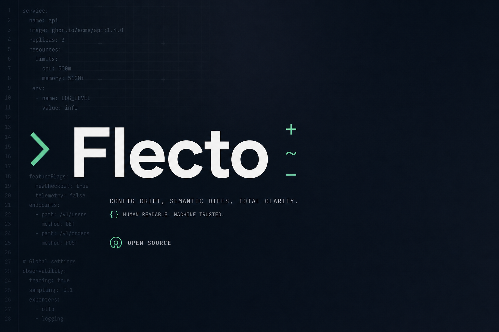

<p align="center">
  
</p>

<h1 align="center">Flecto</h1>

<p align="center">
  <strong>Know what your config actually changed — and whether it's risky.</strong>
</p>

<p align="center">
  <a href="https://www.npmjs.com/package/flecto"></a>
  <a href="https://github.com/myselfsiddharth/Flecto/actions/workflows/ci.yml"></a>
  <a href="LICENSE"></a>
  <a href="#documentation"></a>
</p>

<p align="center">
  
</p>

---

Config drives the parts of a system that break loudest: connection pools, feature
flags, TLS, retries, secrets. But we still review it as text — so a reordered key
looks identical to a doubled pool size, and `debug: true` slips through in a
40-line formatting diff.

Flecto reads config as structure, not lines. It tells you what changed in plain
English, flags what looks risky, and gives you an exit code to gate on.

| Reviewing config without Flecto | With Flecto |
|---|---|
| `+ 40 lines of YAML noise` | `~ database.pool_size: 5 → 20` |
| Hope someone notices `debug: true` | Policy finding → build fails |
| "Something in `.env` changed" | The exact keys, with secrets masked |

---

## Install

```bash
npm install -g flecto
```

Requires **Node.js 20.19.0+**. Verify:

```bash
flecto --version
flecto doctor
```

Prefer not to install globally? Every example below works with
`npx --yes flecto@2` instead of `flecto`.

---

## Quick start

A complete walkthrough, start to finish. Copy-paste it anywhere.

**1. Create a config file to track.**

```bash
mkdir flecto-demo && cd flecto-demo && mkdir config
cat > config/prod.yaml <<'EOF'
database:
  host: db.internal
  pool_size: 5
  ssl: true
logging:
  level: info
  debug: false
EOF
```

**2. Save it as your baseline.**

```bash
flecto watch config/prod.yaml --snapshot
```

```
✓ Snapshot saved: /path/to/flecto-demo/.flecto-snapshots/4b8cbbd70d1832a2.json
```

**3. Make the kind of edit that causes incidents.**

```bash
cat > config/prod.yaml <<'EOF'
database:
  host: db.internal
  pool_size: 20
  ssl: true
logging:
  level: info
  debug: true
EOF
```

**4. Ask what changed.**

```bash
flecto watch config/prod.yaml --diff
```

```
/path/to/flecto-demo/config/prod.yaml — 2 changes from snapshot:
  ~ database.pool_size: 5 → 20
  ~ logging.debug: false → true
```

Two sentences instead of a diff you have to interpret. Now let Flecto judge it:

```bash
flecto ci config/prod.yaml --format github-annotations
```

```
::warning title=flecto changed::database.pool_size
::warning title=flecto changed::logging.debug
::warning title=flecto policy pool-size-jump [default]::database.pool_size: Pool size increased from 5 to 20 (>=2x).
::error title=flecto policy dangerous-toggle-enabled [default]::logging.debug: Potentially dangerous toggle enabled.
```

Exit code `1`. In CI, that's a failed build — before the change ships.

**5. Watch it live.** Leave this running and edit the file in another window:

```bash
flecto watch config/prod.yaml
```

```
flecto watching /path/to/flecto-demo/config/prod.yaml
Press Ctrl+C to stop.

[18:24:48] /path/to/flecto-demo/config/prod.yaml — 2 changes
  ~ database.pool_size: 5 → 20
  ~ logging.debug: false → true
  ! policy(warn) [default] database.pool_size: Pool size increased from 5 to 20 (>=2x).
  ! policy(error) [default] logging.debug: Potentially dangerous toggle enabled.
```

That's the whole product. Everything below is depth.

---

## What you can do with it

### Catch risky changes before they merge

Add one step to your workflow and risky config edits show up as annotations on
the pull request:

```yaml
permissions:
  contents: read

steps:
  - uses: actions/checkout@v7
    with:
      fetch-depth: 2
  - uses: myselfsiddharth/Flecto/.github/actions/flecto-ci@main
    with:
      targets: config/**/*.{yaml,yml,json,toml,ini}
      snapshot-ref: HEAD~1
```

Works on any CI runner — it's a plain CLI with meaningful exit codes.
→ **[CI guide](docs/ci.md)**

### Trigger automation on change

Restart a service, reload a process, or notify an endpoint whenever config moves:

```bash
flecto watch .env --command "docker-compose restart app"

flecto watch config/prod.yaml \
  --webhook https://hooks.example.com/notify \
  --delivery-mode at-least-once
```

Changes arrive as a versioned JSON envelope, and `at-least-once` persists and
retries failed deliveries. → **[Webhooks and commands](docs/webhooks.md)**

### Track drift over time

```bash
flecto history config/prod.yaml --limit 10
```

Snapshots stay on your machine in `.flecto-snapshots/`. Nothing is uploaded and
no account is required. → **[CLI reference](docs/cli-reference.md#flecto-history-files)**

### Encode your own rules

Beyond the built-in packs, write rules as declarative JSON or YAML — no code:

```json
{
  "id": "risky-feature-enable",
  "severity": "error",
  "allOf": [
    { "match": { "pathPrefix": "features." } },
    { "afterTruthy": true }
  ]
}
```

For anything a predicate can't express, a local ESM plugin exporting
`evaluate(changes, ctx)` gets the full change set.
→ **[Writing policy packs](docs/policy-packs.md)** · **[Plugins](docs/plugins.md)**

### Cut the noise

```bash
flecto watch config/prod.yaml --ignore "updated_at,**.meta.timestamp"
```

Arrays of objects are matched by `id` or `name`, so reordering a list of named
services doesn't read as a wall of changes.
→ **[Configuration](docs/configuration.md)**

---

## Built-in policy packs

| Pack | Catches |
|---|---|
| `default` | Secret-like keys added or changed, dangerous toggles, pool-size jumps |
| `strict-prod` | The same ground, with production-grade severities and matching |
| `compose` | Privileged services, host networking, Docker socket mounts, sensitive bind mounts |
| `node-runtime` | Dropped engine requirements, TLS verification bypasses, debug/inspector flags |

```bash
flecto policies list          # see what resolves here, built-in and local
flecto ci "config/**/*.yaml" --policies "default,strict-prod" --fail-on policy
```

Pass files or glob patterns, quoted so your shell doesn't expand them first — a
bare directory is not a valid target.

A local `policies/<id>.json` overrides the built-in pack of the same id, and
`severityRemap` raises or silences individual rules per profile without forking
anything. → **[Policy packs](docs/policy-packs.md)**

---

## Supported formats

| Format | Extensions |
|---|---|
| JSON | `.json` |
| YAML | `.yaml`, `.yml` |
| TOML | `.toml` |
| INI | `.ini` |
| dotenv | `.env`, `.env.*`, `*.env` |

---

## Configuration

Most teams commit a `.flectorc` so local runs and CI agree:

```bash
flecto init
```

```json
{
  "defaults": {
    "policies": ["default"],
    "ignore": ["**.updated_at"]
  },
  "profiles": {
    "dev": { "mode": "verbose" },
    "ci": { "failOn": "policy,error" },
    "prod": {
      "policies": ["default", "strict-prod"],
      "severityRemap": { "pool-size-jump": "error" },
      "maskSecrets": true
    }
  },
  "files": ["config/**/*.{yaml,yml,json,toml,ini}", ".env"]
}
```

```bash
flecto watch --profile dev
flecto ci --profile ci
```

Explicit CLI flags win over profiles, which win over `defaults`.
→ **[Full configuration reference](docs/configuration.md)**

---

## Commands

| Command | What it does |
|---|---|
| `flecto watch [files...]` | Watch for changes and print them as they happen |
| `flecto watch --snapshot` | Save the current state as a baseline |
| `flecto watch --diff` | Compare against the baseline and exit |
| `flecto ci [files...]` | One-shot check with a gate-able exit code |
| `flecto history [files...]` | Summarize drift across local snapshots |
| `flecto policies list` | List available policy packs |
| `flecto policies test <dir>` | Assert pack and plugin findings from fixtures |
| `flecto init` | Create a starter `.flectorc` |
| `flecto doctor` | Check setup, config, and environment |

→ **[Every flag, every command](docs/cli-reference.md)**

---

## Documentation

| Guide | Covers |
|---|---|
| **[CLI reference](docs/cli-reference.md)** | Every command, flag, and exit code |
| **[Configuration](docs/configuration.md)** | `.flectorc`, profiles, ignore patterns, array identity, masking |
| **[CI](docs/ci.md)** | Baselines, fail triggers, output formats, the GitHub Action |
| **[Webhooks and commands](docs/webhooks.md)** | Envelope shape, delivery modes, command environment |
| **[Policy packs](docs/policy-packs.md)** | Writing declarative rules |
| **[Plugins](docs/plugins.md)** · **[Cookbook](docs/plugin-cookbook.md)** | Rules that need real code |
| **[Troubleshooting](docs/troubleshooting.md)** | When something doesn't behave |
| **[Changelog](CHANGELOG.md)** | Release history and migration notes |

---

## How it works

1. **Parse** — format detected by extension or dotenv naming → structured values
2. **Watch** — [chokidar](https://github.com/paulmillr/chokidar) with debounce
3. **Diff** — semantic tree comparison with ignore rules and array identity
4. **Evaluate** — policy packs and plugins → severity-tagged findings
5. **Emit** — a versioned envelope (`schema_version: "2.0"`)
6. **Deliver** — terminal output, shell command, webhook, or CI annotations

Flecto runs entirely on your machine. Snapshots are local files, and nothing
leaves the process unless you configure a webhook or command.

---

## Project

- **Questions and ideas** — [Discussions](https://github.com/myselfsiddharth/Flecto/discussions)
- **Bugs and requests** — [Issues](https://github.com/myselfsiddharth/Flecto/issues)
- **Contributing** — [CONTRIBUTING.md](CONTRIBUTING.md) · [Code of Conduct](CODE_OF_CONDUCT.md)
- **Security** — [SECURITY.md](SECURITY.md), private disclosure only
- **Roadmap** — [Milestones](https://github.com/myselfsiddharth/Flecto/milestones)

Released under the [MIT License](LICENSE).
