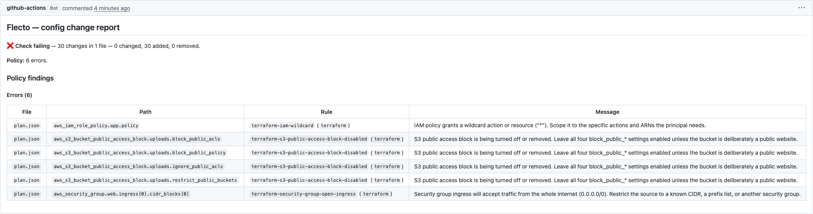

<h1 align="center">Flecto</h1>

<p align="center">
  <strong>Flecto reads your Terraform plan and Kubernetes changes and posts a
  plain-English risk summary on every pull request, blocking the dangerous ones.</strong>
</p>

<p align="center">
  <a href="https://github.com/marketplace/actions/flecto-pr-risk"></a>
  <a href="https://www.npmjs.com/package/flecto"></a>
  <a href="https://github.com/myselfsiddharth/Flecto/actions/workflows/ci.yml"></a>
  <a href="LICENSE"></a>
  <a href="#documentation"></a>
</p>

---

## What lands on the pull request

<p align="center">
  
</p>

That is a real comment on a
**[real pull request](https://github.com/myselfsiddharth/flecto-example-terraform/pull/1)**
you can open right now. The PR says it is about partner access and changes eight
lines; it opens the web tier to the internet, turns off the bucket's
public-access protection, and widens an IAM policy to `s3:*` on `*`.

One sticky comment, updated in place on every push. Exit code `1`, so the build
fails before the change ships.

**[The same gate on an ordinary change](https://github.com/myselfsiddharth/flecto-example-terraform/pull/2)**
reports *no findings* and passes. That matters as much: a check that fires on
everything gets uninstalled in a week.

<details>
<summary>The same report as text, and what a plan with existing state adds</summary>

The comment above, as `flecto plan` prints it:

```
❌ Check failing — 30 changes in 1 file — 0 changed, 30 added, 0 removed.
Policy: 6 errors.

aws_security_group.web.ingress[0].cidr_blocks[0]
  terraform-security-group-open-ingress
  Security group ingress will accept traffic from the whole internet
  (0.0.0.0/0). Restrict the source to a known CIDR, a prefix list, or
  another security group.

aws_s3_bucket_public_access_block.uploads.block_public_acls        (+3 more)
  terraform-s3-public-access-block-disabled
  S3 public access block is being turned off or removed.

aws_iam_role_policy.app.policy
  terraform-iam-wildcard
  IAM policy grants a wildcard action or resource ("*").
```

The example repository has no Terraform state, so every resource shows as
`create`. With existing state, a plan that replaces a database also reports:

```
aws_db_instance.main.#action
  terraform-stateful-resource-destroyed
  Terraform will destroy a stateful resource. Its data does not survive.
  Take a final snapshot, or add a prevent_destroy lifecycle block, before
  applying.
```

</details>

---

## Add it in 60 seconds

Flecto PR Risk is on the
[GitHub Marketplace](https://github.com/marketplace/actions/flecto-pr-risk), so
`myselfsiddharth/Flecto@v4.2.0` is the whole reference.

**Terraform** — point it at the plan JSON:

```yaml
permissions:
  contents: read
  pull-requests: write

steps:
  - uses: actions/checkout@v7
  - run: |
      terraform plan -out=tf.plan
      terraform show -json tf.plan > plan.json
  - uses: myselfsiddharth/Flecto@v4.2.0
    with:
      terraform-plan: plan.json
      fail-on: error
```

**Kubernetes** — render your manifests, then diff them against the PR's base:

```yaml
permissions:
  contents: read
  pull-requests: write

steps:
  - uses: actions/checkout@v7
    with:
      fetch-depth: 0
  - run: helm template ./chart > rendered.yaml
  - uses: myselfsiddharth/Flecto@v4.2.0
    with:
      targets: rendered.yaml
      policies: kubernetes
```

Flecto **never invokes** `terraform`, `helm`, `kustomize`, `sops`, or `age`, so
nothing extra has to exist on the runner. → **[CI guide](docs/ci.md)**

---

## What it catches

- **A database about to be destroyed** — `terraform plan` says `replace`, the
  diff says the data does not survive
- **Ingress widened to the world** — `10.0.0.0/8` → `0.0.0.0/0` on a security
  group
- **An IAM policy gone wildcard** — `Action: "*"` where it used to be scoped
- **S3 public-access protection switched off** — the block removed, not just
  loosened
- **A container turned privileged**, or `runAsNonRoot` quietly weakened
- **Resource limits removed** from a Deployment, so one pod can starve a node
- **An image tag unpinned** — `:1.4.0` → `:latest`
- **A new recipient on a SOPS file** — someone who could not decrypt it now can
- **`debug: true` in a 40-line formatting diff**, or a connection pool
  quadrupled

Rules live in [policy packs](docs/policy-packs.md) you can extend, remap, or
replace.

---

## Also works as

| | |
|---|---|
| **A CLI** | `flecto ci`, `flecto plan`, `flecto compare` — plain exit codes, any runner → **[CLI reference](docs/cli-reference.md)** |
| **A file watcher** | `flecto watch` reports changes as you edit → **[Getting started](docs/getting-started.md)** |
| **A webhook / command trigger** | Restart a service or notify an endpoint on change → **[Webhooks](docs/webhooks.md)** |
| **An MCP server** | Read-only `diff`, `check`, `explain` tools for agents → **[MCP](docs/mcp.md)** |
| **An editor language server** | `flecto lsp` — diagnostics while you type → **[Editor](docs/editor.md)** |
| **A drift detector** | `flecto-drift` compares declared config against what is running → **[Drift](docs/drift.md)** |

---

## Stability

Flecto runs inside your merge path. The **JSON envelope**
(`schema_version: "2.0"`), **exit codes** (`0` clean, `1` failed — it fails
closed), **`.flectorc`** keys, and **command and flag names** follow
[semver](https://semver.org/), and no breaking change to them ships without a
minor release that warns first. The one exception is a security fix.

Terminal output, message wording, and anything under `src/` are deliberately
**not** stable — parse `--format json`.

→ **[Full stability policy](docs/stability.md)**

---

## Documentation

| Guide | Covers |
|---|---|
| **[Getting started](docs/getting-started.md)** | A full walkthrough, from install to a failing build |
| **[CI](docs/ci.md)** | Baselines, fail triggers, output formats, the bundled Actions, pinning |
| **[Terraform plans](docs/terraform.md)** | Reviewing `terraform show -json` output and the `terraform` pack |
| **[Kubernetes](docs/kubernetes.md)** | Diffing rendered Helm/Kustomize manifests before they reach a cluster |
| **[Comparison](docs/comparison.md)** | Honest comparison with Checkov, Trivy/tfsec, conftest/OPA, tf-summarize, dyff |
| **[Supported formats](docs/formats.md)** | YAML, JSON, TOML, INI, dotenv, age — and what each one accepts |
| **[Encrypted files](docs/encrypted-files.md)** | SOPS and age: what is detected, why nothing is decrypted |
| **[Configuration](docs/configuration.md)** | `.flectorc`, profiles, ignore patterns, array identity, masking |
| **[CLI reference](docs/cli-reference.md)** | Every command, flag, and exit code |
| **[Policy packs](docs/policy-packs.md)** | Writing declarative rules |
| **[Plugins](docs/plugins.md)** · **[Cookbook](docs/plugin-cookbook.md)** | Rules that need real code |
| **[Webhooks and commands](docs/webhooks.md)** | Envelope shape, delivery modes, command environment |
| **[MCP server](docs/mcp.md)** | Read-only diff/check/explain tools for agents, and the security posture |
| **[Explain](docs/explain.md)** | Opt-in model narration of a diff: what is sent, what it can never do, cost |
| **[Editor diagnostics](docs/editor.md)** | `flecto lsp` setup for Neovim, Helix, Emacs |
| **[Live drift](docs/drift.md)** | `flecto-drift`: declared config versus what is actually running |
| **[Performance](docs/performance.md)** | Where time goes at scale |
| **[Stability](docs/stability.md)** | What you can build against, and the deprecation sequence |
| **[Troubleshooting](docs/troubleshooting.md)** | When something doesn't behave |
| **[Migrating to 4.0](docs/migrating-to-4.md)** | The five breaking changes, and whether they affect you |
| **[Changelog](CHANGELOG.md)** | Release history and migration notes |

---

## Project

- **Questions and ideas** — [Discussions](https://github.com/myselfsiddharth/Flecto/discussions)
- **Bugs and requests** — [Issues](https://github.com/myselfsiddharth/Flecto/issues)
- **Contributing** — [CONTRIBUTING.md](CONTRIBUTING.md) · [Code of Conduct](CODE_OF_CONDUCT.md)
- **Security** — [SECURITY.md](SECURITY.md), private disclosure only
- **Roadmap** — [Milestones](https://github.com/myselfsiddharth/Flecto/milestones)

Released under the [MIT License](LICENSE).
